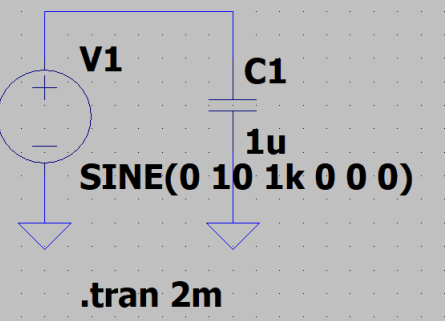
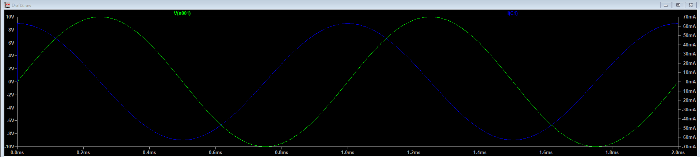
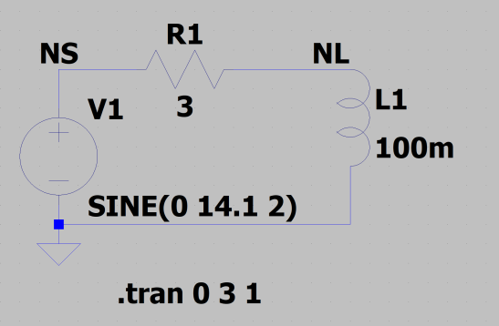
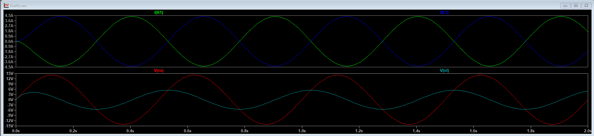
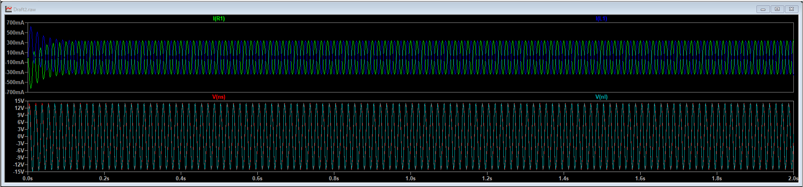
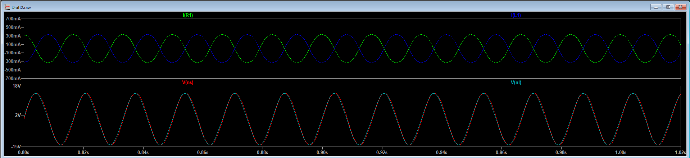
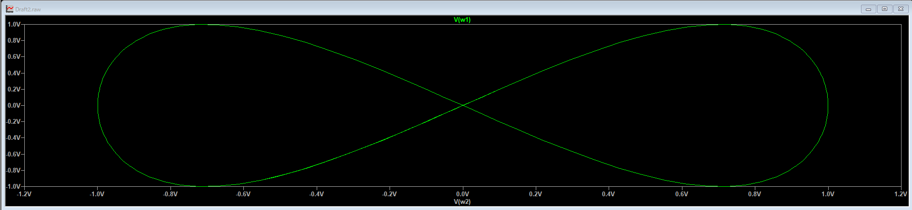
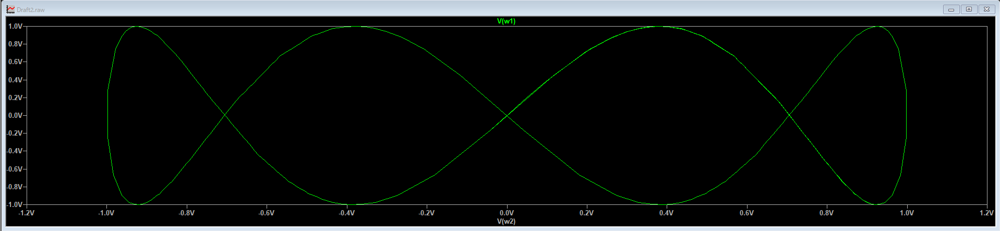
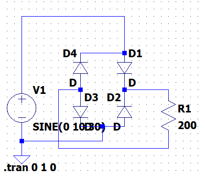
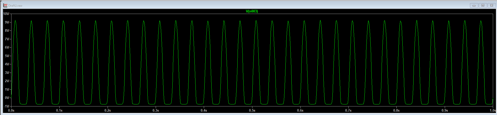

# 

### 目的

### 課題１
> 下のような静電容量Cと電圧源からなる回路を作成し，Cの電圧波形と電流波形を描画すること．
その際に，Cにかかる電圧と流れる電流の位相差はどうなっているか考察せよ．

**実験回路**  
  

**実験結果**  

### 課題２
> 下の図のようなRL直列回路を作成し，R,Lそれぞれにかかる電圧波形と電流波形を描画せよ．
その結果から，電流・電圧の位相特性について考察せよ．  

**実験回路**  
  

**実験結果**  

<2Hzの場合>

<60Hzの場合>

### 課題３

### 追加課題

この電圧波形を確認すると