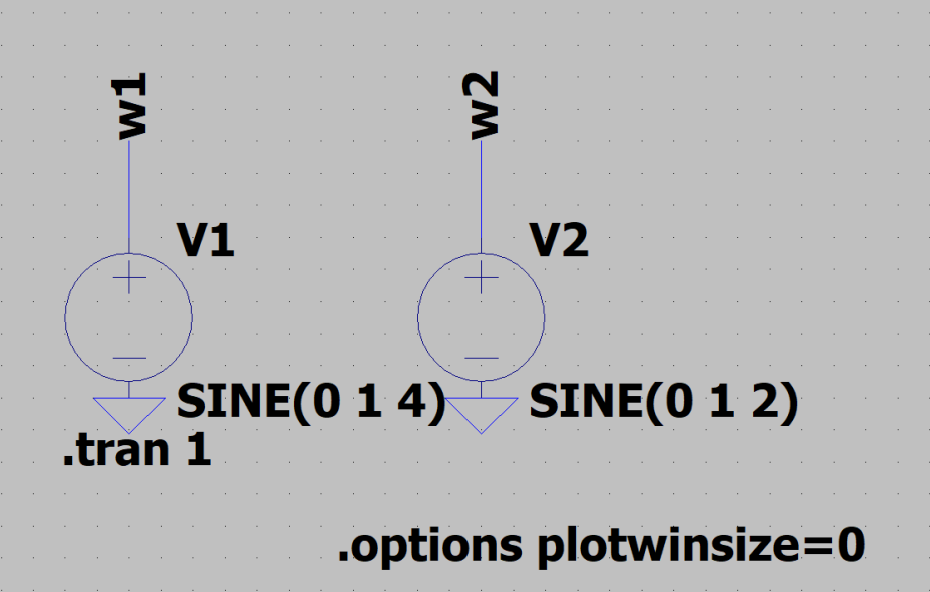
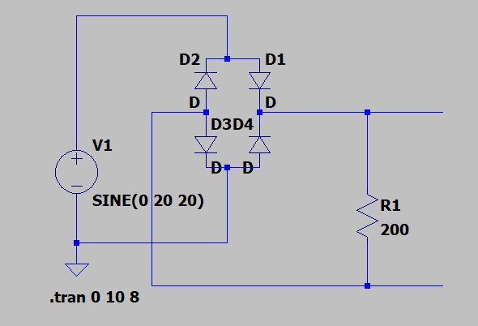
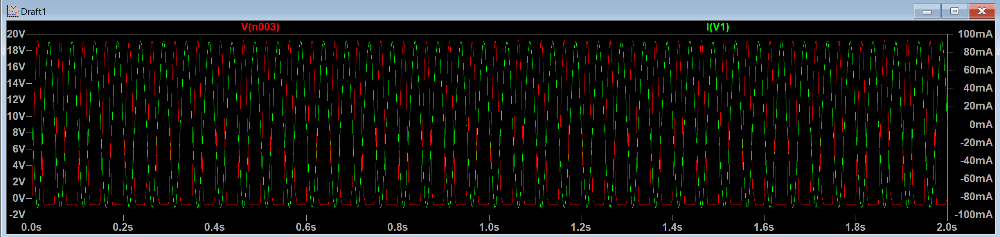

# LP SPICE入門

### 目的

### 課題１
> 下のような静電容量Cと電圧源からなる回路を作成し，Cの電圧波形と電流波形を描画すること．その際に，Cにかかる電圧と流れる電流の位相差はどうなっているか考察せよ．

**実験回路**  
  

**実験結果**  

**考察**

写真からわかるように電圧と電流の位相差は、π/2ずれていることがわかる。  
理由は、

$$
i_C = I_M \sin \omega t \quad [A]
$$
---
$$
v_C = \frac{1}{C} \int i_C dt = \frac{1}{C} \int I_M \sin \omega t dt
$$

$$
= \frac{I_M}{C} \int \sin \omega t dt = -\frac{I_M}{\omega C} \cos \omega t
$$

$$
= \frac{I_M}{\omega C} \sin \left( \omega t - \frac{\pi}{2} \right) \quad [V]
$$

と書けるから。コンデンサの電流は、電圧よりもπ/2進んでいることがわかる。

[参考及び引用元](https://detail-infomation.com/capacitor-90-degrees-shift/)

### 課題２
> 下の図のようなRL直列回路を作成し，R,Lそれぞれにかかる電圧波形と電流波形を描画せよ．
その結果から，電流・電圧の位相特性について考察せよ．  

**実験回路**  
  

**出力波形**  

<2Hzの場合>

<60Hzの場合>

**考察**

*本来、抵抗とインダクタンスとの波形は同位相であるが、LP SPICEの抵抗の特性で極性が存在し、逆位相になった。  

電圧の位相特性だが、
$$
Z = R - jX_C = R - j\frac{1}{\omega C}
$$
$$
\theta = \tan^{-1} \left( -\frac{1}{\omega R C} \right)
$$

という式で書き換えることが可能であり、周波数は
$$ \omega = 2πf $$  
より周波数に依存していることが分かる。よって、電圧の位相特性は、周波数によって変化し周波数が大きくなるほど、位相は近くなる。
### 課題３
> 下の図のように２つの電圧源を配置し，「リサージュ図形」を観測せよ． 

>> <h4>問 リサージュ図形とは何か</h4>  
>>答　

>>互いに直交する二つの単振動を合成して得られる平面図形のこと。 [引用元](https://ja.wikipedia.org/wiki/%E3%83%AA%E3%82%B5%E3%82%B8%E3%83%A5%E3%83%BC%E5%9B%B3%E5%BD%A2)

**実験回路**  
  

**出力波形**  
< w1=1[v]+4[Hz] w2=1[v]+2[Hz] >

< w1=1[v]+60[Hz] w2=1[v]+15[Hz] >

**考察**  
w1、w2のsin波が重なり合ってできるのがリサージュ図形である。そのためお互いの周波数の比が図形の形に反映されることがわかる。そのため一枚目の写真は、4[Hz]:2[Hz]=2:1となり、w2が1周期終わるたびにw1が2周期するためこのような図形になる。2枚目も同様に考えると、w2が1周期終わるたびにw1が4周期するような図形になる。  
[参考](https://www.cqpub.co.jp/column/books/2001a/11891osiro/oscillo7.htm)

### 追加課題

**<全波整流回路>**

**出力波形**  

**考察**  
ダイオードを4つ使用することで、交流の両半波を同じ極性に整流されている。
ただ写真を見てわかる通り、若干、出力電圧が負の値になっていることがわかる。その理由はダイオードに順方向印可の時のダイオードの電圧降下である。ダイオードの電圧降下は、0.7[V]である。この回路は2つのダイオードを通るので、1.4[V]降下する。